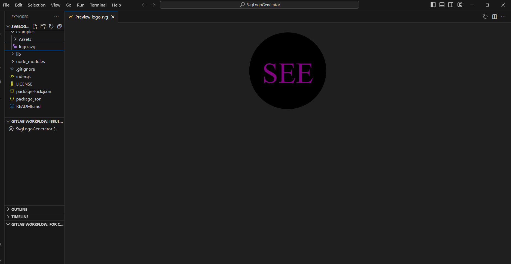

# SVG Logo Generator

## Description

The Logo Generator is a command-line application that allows users to create custom logos using SVG. Users can provide text, text color, choose from various shapes (circle, square, or triangle), and specify the shape color. The application generates an SVG file named `logo.svg` that displays the logo according to the user's specifications.

## Video Demo

## Table of Contents

- [Installation](#installation)
- [Usage](#usage)
- [License](#license)
- [Contributing](#contributing)
- [Tests](#tests)
- [Questions](#questions)

## Installation

To install the Logo Generator, follow these steps:

1. Clone the repository to your local machine.
2. Navigate to the project's root directory in the command line.
3. Run the following command:

npm install

This will install the required dependencies.

## Usage

To use the Logo Generator, follow these steps:

1. Navigate to the project's root directory in the command line.
2. Run the following command to start the application:

npm start

You will be prompted to provide information about your logo, including text, text color, shape, and shape color.

The application will generate an SVG logo based on your input and save it as logo.svg in the project's examples folder.

## License

This project is licensed under the MIT License.

## Contributing

We welcome contributions from the open-source community. If you have suggestions, bug reports, or want to contribute to the development of this project, please follow these guidelines:

1. Fork the project on GitHub.
2. Create a new branch for your feature or bug fix.
3. Make your changes and commit them.
4. Push your changes to your fork.
5. Submit a pull request.

## Tests

To run tests for this project, follow these steps:

1. Ensure that the project dependencies are installed (see Installation section).
2. In the command line, run the following command:

npm test

This will execute tests and provide feedback on the project's functionality.

## Questions

If you have any questions or need further assistance, please feel free to reach out to me:

GitHub: [@Fiqre-Ab](https://github.com/Fiqre-Ab/SvgLogoGenerator)
